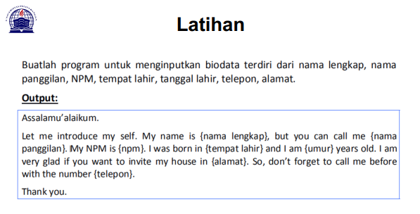
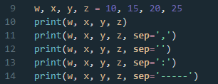

# LatihanVCS

# Tugas pertemuan ke 4, 5 Dan 6 Bahasa Pemrograman

Nama : M. Aqil Alfarid

NIM : 312010140

Kelas : TI.20.B.1

Prodi : Teknik Informatika

# Cara Menggunakan Git dan Github :

1. Install git terlebih dahulu (www.git-scm.com)

2. Setelah Menginstall Git, silahkan cek untuk melihat versi Git yg anda install dengan mengetik di CMD " git version "

3. Selanjutnya , masukkan username GitHub anda menggunakan perintah dibawah ini, Lalu tekan ENTER jika sudah benar.

4. Kemudian masukkan email yang terdafrtar di GitHub anda menggunakan perintah dibawah ini, lalu tekan ENTER jika sudah benar.

5. Selanjutnya untuk memastikan proses login Anda berhasil, maka lakukan perintah berikut.

6. Login ke Github

7. Buat akun terlebih dahulu jika anda baru pertama kali menggunakan GitHub (www.github.com)

8. Buat Repository baru dengan pilihan "New Repository" pada Home GitHub.

9. Jika sudah buat folder "LatihanVCS" dan buatlah file contoh "README.md"

10. Jika sudah Buka GitBash lalu masukkan perintah berikut.

11. Selanjutnya , Anda perlu membuat Commit. Commit berfungsi untuk menambahkan update file serta komentar. Jadi setiap Kontributor bisa memberikan konfirmasi update file di proyek yang sedang dikerjakan.
Masukkan perintah berikut untuk membuat commit.

12. Setelah git commit, lalu anda masukkan perintah git log . Untuk melihat status Kontributor apa aja yang update.

13. Lakukan Remote Repository berfungsi untuk mengupload file yang telah anda buat sebelumnya di Local Disk. Masukkan perintah berikut ini untuk melakukan Remote Repository.

14. Langkah Terakhir adalah Push ke Github. Push ini berfungsi untuk mengupload hasil akhir dari langkah-langkah di atas. Masukkan perintah berikut untuk melakukan push ke GitHub. " git push -u origin "
--> Perintah di Atas akan menampilkan Pop Up Sign In Github. Anda perlu login untuk melanjutkan proses Push ke Github.

15. Selesai Anda sudah berhasil menginstall Git dan juga menggunakan Git dan GitHub.

# PYHTON

# Tugas pertemuan ke 5

1. Saat ini saya akan menjelaskan hasil dari tugas tersebut berikut source code nya:

Source code diatas berfungsi untuk mencetak hasil / output berupa "====Biodata====".

untuk menampilkan output, saya menggunakan tanda petik dua didalam fungsi print("")

2. Untuk menghitung rumus umur saya menggunakan variable dob yaitu 2020 (Tahun Sekarang) dikurangi dengan Year of Birth, pada source code berikut :

3. Langkah kali ini saya akan menampilkan output yang diminta oleh Dosen. Outputnya, yaitu dengan syntax/source code berikut :

Fungsi huruf f pada perintah print(f"...") adalah fungsi print atau bisa memudahkan programmer dalam mencetak statement dalam satu baris.

4. Sedangkan fungsi , pada output tersebut adalah untuk menampilkan hasil dari outputnya Hasil dari output tersebut seperti berikut :

Selesai Tugas 5 ini.

# TUGAS 6 LAB 1

Penggunaan END Penggunaan end digunakan untuk menambahkan karakter yang dicetak di akhir baris. Secara default penggunaan end adalah untuk ganti baris. Syntax dibawah ini digunakan untuk menampilkan output berupa string

Hasilnya :

Penggunaan Separator Separator adalah pemisah yang berfungsi sebagai tanda pemisah antar objek yang dicetak. Defaultnya adalah tanda spasi.

Pendeklarasian beberapa variable beserta nilainya

w,x,y,z=10,15,20,25
Menampilkan hasil dari variable tiap-tiap variable

print(w,x,y,z)
Menampilkan hasil dari tiap-tiap variable dengan menggunakan pemisah , (koma)

print(w,x,y,z,sep=",")
Menampilkan hasil dari tiap-tiap variable tanpa menggunakan pemisah

print(w,x,y,z,sep="")
Menampilkan hasil dari tiap-tiap variable dengan menggunakan pemisah : (titik dua)

print(w,x,y,z,sep=":")
Menampilkan hasil dari tiap-tiap variable dengan menggunakan pemisah -----

print(w,x,y,z,sep="-----")

Hasilnya :

String Format

String formatting atau pemformatan string memungkinkan kita menyuntikkan item kedalam string daripada kita mencoba menggabungkan string menggunakan koma atau string concatenation.

String Format 1 Pada syntax / source code string format 1 akan menampilkan output berupa 2 outputan. Yang pertama (sebelah kiri) akan menampilkan angka Urut dari angka 0 hingga angka 10, sedangkan untuk sebelah kanan akan menampilkan Operasi Aritmatika Pangkat. Dengan ketentuan sebagai berikut, operasi pangkat dengan angka kiri sebagai pokok (Rumus : ** [bintang dua] )

Hasilnya : 

Hasil dari syntax tersebut adalah 10 pangkat 0, hingga 10 pangkat 10. dengan output sebagai berikut :

Hasilnya :

String Format 2 Pada syntax atau source code string format 2 akan menampilkan output berupa 2 output'an juga (seperti String Format 1, yaitu kanan dan kiri) Dengan ketentuan sebagai berikut : Alignment, padding, dan precesion dengan .format() dalam kurung kurawal kita dapat menetapkan panjang bidang, rata kanan/kiri, parameter pembulatan dan banyak lagi. Secara Default, .format() menggunakan rata teks ke kiri, angka ke kanan. Kita dapat menggunakan opsi opsional <, ^, atau > untuk mengatur perataan kiri, tengah, atau kanan.

# TUGAS 6 LAB 2

Disini kita akan menggunakan Penambahan dan Pembagian. Berikuta source code nya.

Dan ini hasil Outputnya.

Selesai.

# Terima Kasih 
